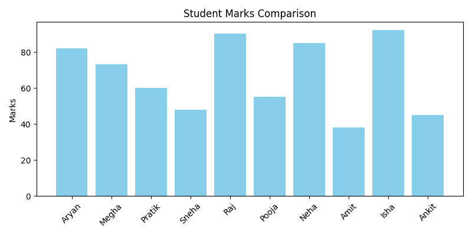

# 📚 Project 2: Student Performance Analytics Dashboard

## 🎯 Objective
To analyze student data and identify performance trends & struggling students.

## 🛠️ Tools Used
- Python
- pandas
- matplotlib
- seaborn

## 📁 Dataset
- Fields: `Name`, `Marks`, `Attendance (%)`, `Logins`

## 📊 Features Implemented
- Correlation heatmap (Marks vs Attendance vs Logins)
- List of top performers (Marks ≥ 75)
- List of struggling students (Marks < 50)
- Bar chart comparison of all students

## 📸 Output
  

## 👩‍💻 Author
Suparna Chaudhari – RISE Internship 2025
